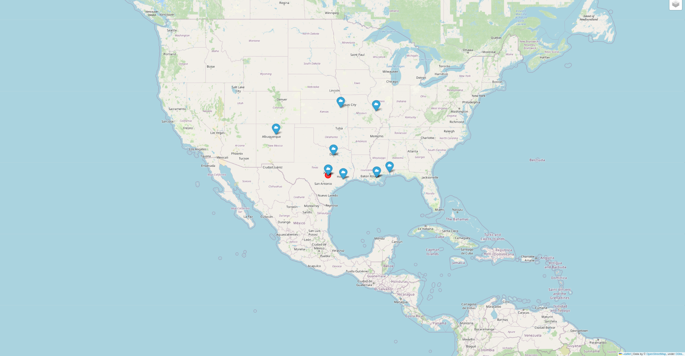

This is README for my programming laboratory work.\
My program creates a map with marks\
What are these marks?\
It's 10 (or less) nearest (to a particular location) locations\ 
of where movies of a particular year were shot.\
The user enters the year, the desired location and the the path\
to dataset they want to be use for this program.\
However, the program takes only a random part of the file so the running time isn't that long
(is that cheating???)\
I tried to make it work.\
Try it yourself!\
\
How to run (example):
```
python main.py 2000 49.83826 24.02324 path_to_dataset
```
